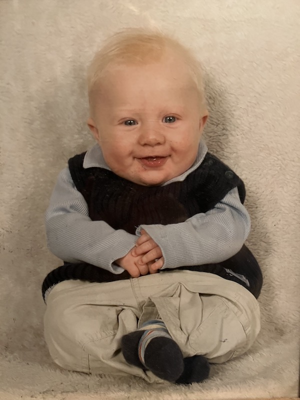

# Class
## Nick Boschi

My computer experience so far includes some of the basic, required courses for the compuer science major. I have always been interested in computer and electronics, as well as building things. I havn't worked on any very interesting projects but I would like to build a pc. The most interesting course I have taken so far has been digital logic.

I decided to take web programming as a computer science elective because it is an area that I know very little about but would like to learn. It seems very interesting and useful. I'm not sure sure yet where I will use what I learn in this course

<!---  --->
